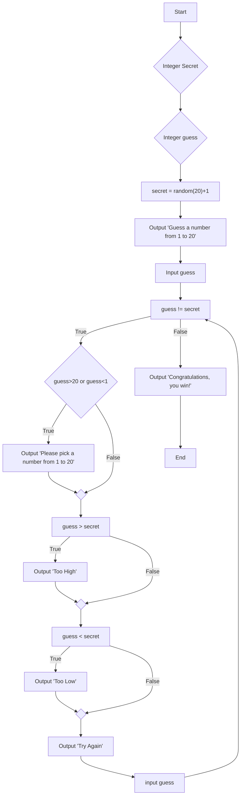

- B and C are establishing secret and guess as integers for the game.
- D is assigning a variable named "secret" as a random number from 1-20
- E is giving a prompt for guessing "guess"
- F is to establish the variable "guess"
- G is checking if you got it correctly, if not, you get into the H through R loop.
- H is checking if the number is beyond the bounds of the question
- L is checking if the number is too high
- N is checking if the number is too low
- Q is prompting you to try again and input a new value for "guess"
- S is the output if you get it correct and win.